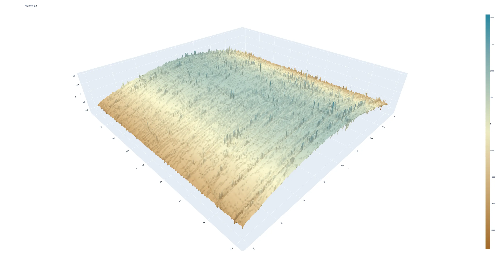

# Usage
first make sure you have the required python dependencies. if you're using Nix, you can just enter a nix-shell with:

❯ nix-shell

otherwise you can inspect the dependencies in the shell.nix file and use your preferred method (TODO: add requirements.txt or its UV equivalent or whatever non-Nix python devs are using these days, poetry??).

❯ python3 accelerated.py ringgage_100fps_500nmps.AVI --gpu

tested and developed on linux, testing on Macos is todo, and windows is a maybe as I don't have a windows machine

# License
this project is licensed under the terms of the GNU General Public License v3.0. See [LICENSE](./gpl-3.0.txt) for details. I'm happy to consider requests for more permissive licensing, find me on Twitter/X as asingleoat or email asingleoat on gmail.
